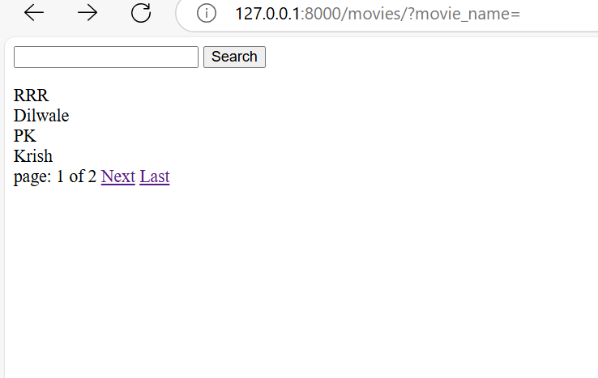
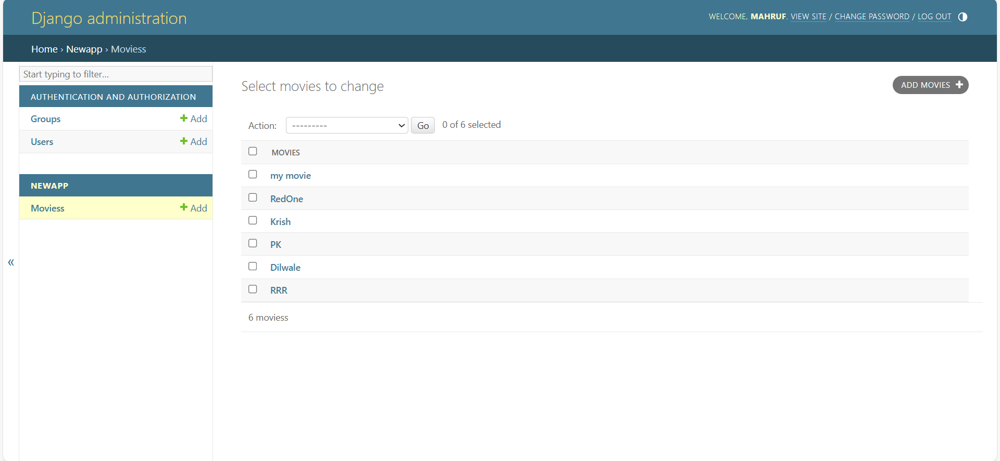
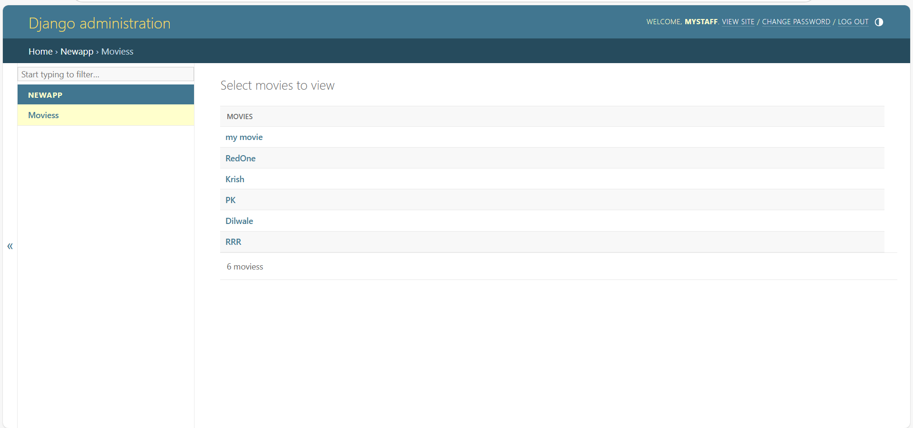

# Pagination,VENV,Search & User Permission 

This project is a Django-based web application that allows users to view and manage a list of movies. It includes features like pagination, an admin interface, and a search bar for filtering movies.

## Features

1. **Movie List**
   - Displays a list of movies on the homepage.
   - Implements pagination to divide the movie list into pages for better usability.

2. **Search Functionality**
   - A search bar on the homepage allows users to filter movies by name.

3. **Django Admin Panel**
   - Provides an interface to add, edit, and delete movies.
   - Role-based access: Admins can manage the movie database.

## Technologies Used

- **Django**: Web framework for building the backend.
- **HTML/CSS**: For designing the frontend pages.
- **SQLite**: Default database provided by Django.

## Installation and Setup

1. Clone the repository:
   ```bash
   git clone https://github.com/CoderMahruf/Django_Pagination-VENV-Search-User_Permission.git
   cd mysite/
   ```

2. Install dependencies:
   ```bash
   pip install -r requirements.txt
   ```

3. Apply database migrations:
   ```bash
   python manage.py makemigrations
   python manage.py migrate
   ```

4. Create a superuser for the admin panel:
   ```bash
   python manage.py createsuperuser
   ```
   Follow the prompts to set up a username and password.

5. Start the development server:
   ```bash
   python manage.py runserver
   ```

6. Access the application:
   - Open the homepage: `http://127.0.0.1:8000/movies/`
   - Open the admin panel: `http://127.0.0.1:8000/admin/`

## Usage

1. **Homepage**:
   - Displays a list of movies with pagination controls.
   - Use the search bar to find specific movies by name.

2. **Admin Panel**:
   - Log in using the superuser credentials.
   - Add, edit, or delete movies from the database.

## Screenshots

1. **Homepage**:
   - Movie list with pagination and search functionality.
   - 

2. **Admin Panel**:
   - View and manage movies in the admin interface.
   - 
   - 

## Contributing

Contributions are welcome! If you'd like to contribute, please fork the repository and submit a pull request.

## License

This project is licensed under the MIT License. See the LICENSE file for details.


